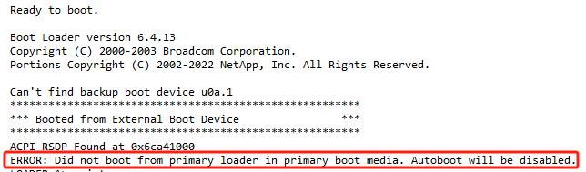

## 1. 准备FAT32格式的U盘，至少4G，里面拷入正确的ontap image和EFI文件夹，正确的ontap image版本需向客户确认


## 2. EFI文件夹需解压service image得到，service image在netapp官网下载
https://mysupport.netapp.com/site/downloads/firmware/system-firmware-diagnostics


## 3.线缆打标签后移除线缆和控制器
## 4.更换boot device
## 5.插入控制器但不要接触到背板
## 6.接上所有线缆和U盘
## 7.完全插入控制器，控制器自动启动
## 8.由于新bootdevice没有image，所以会从U盘启动到loader下


## 9.配置env环境变量
```
LOADER-A> printenv bootarg.init.boot_clustered
LOADER-A> setenv bootarg.init.boot_clustered  true
LOADER-A> printenv bootarg.init.flash_optimized
LOADER-A> setenv bootarg.init.flash_optimized true
LOADER-A> printenv bootarg.init.san_optimized
LOADER-A> setenv bootarg.init.san_optimized true
LOADER-A> printenv bootarg.init.switchless_cluster.enable
LOADER-A> setenv bootarg.init.switchless_cluster.enable 1
```


## 10.写入ontap image
```
LOADER-A> boot_recovery 98P16_q_nodar_image.tgz
```


## 11.Restore Backup Configuration，由于是2节点MCC，没有HA，所以不能从对端恢复，需要从disk恢复


## 12.踩坑
```
1    选6按Y后提示平台不支持FCVI，检查发现ha-config变为ha了，需修改为mcc-2n，维护模式下修改
```


```
2  启动提示0 disks found，需修改ucadmin和在MCC对端heal aggregates和root-aggregates
```


```
heal aggr
site_B::> metrocluster heal -phase aggregates
site_B::> metrocluster heal -phase root-aggregates
ucadmin modify
*> ucadmin modify -t initiator 1a
*> ucadmin modify -t initiator 1b
*> ucadmin modify -t initiator 1c
*> ucadmin modify -t initiator 1d
*> ucadmin modify -t initiator 4a
*> ucadmin modify -t initiator 4b
*> ucadmin modify -t initiator 4c
*> ucadmin modify -t initiator 4d
```

```
重启生效，root盘也找到了
```


## 13.重启node，选6按Y，进行恢复配置，然后正常启动


## 14.switchback
